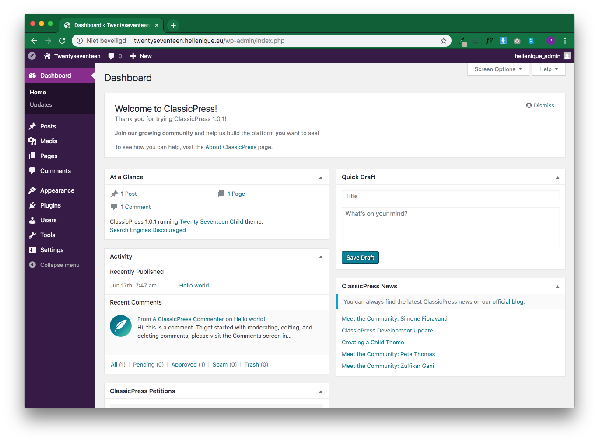
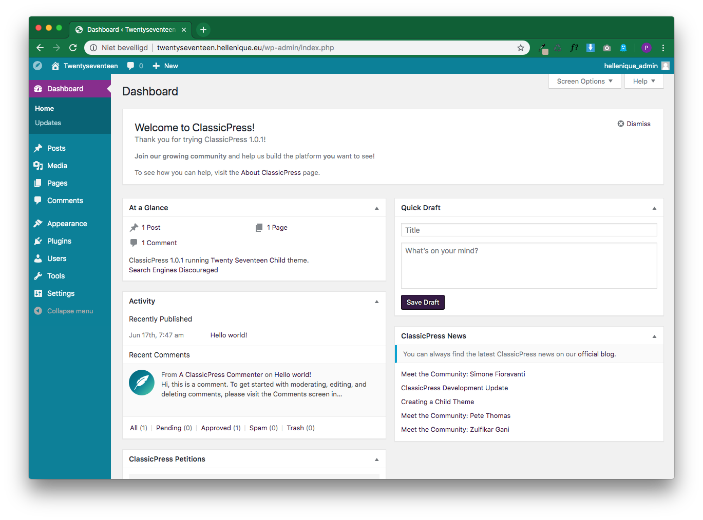
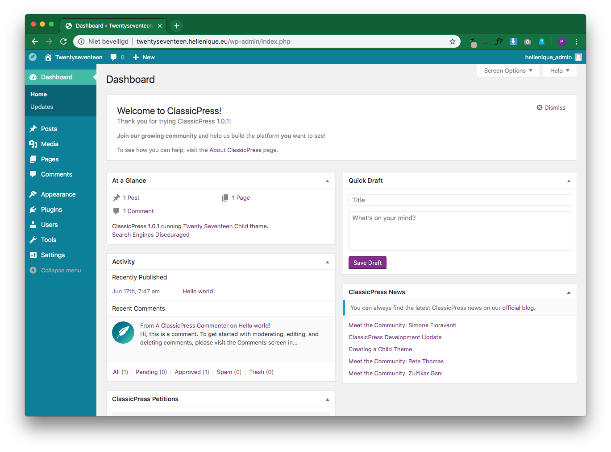

# CP Admin Colors
Tested up to: ClassicPress 1.1.1
License: GPLv2
License URI: http://www.gnu.org/licenses/gpl-2.0.html

User Profile Admin color schemes based on the ClassicPress brand

## Description

Add 3 new style admin color schemes for your ClassicPress website user profiles.

Color schemes in this pack are based on the ClassicPress Brand Guidelines on https://www.classicpress.net/brand-guidelines/ and realized by Klein.

## Screenshots 

All screenshots in the screenshot folder by Klein.

## Settings

CP Admin Colors will change the default admin color scheme for new users to default ClassicPress scheme. 

To turn this off go to Settings > Writing and uncheck the checkbox.

## Changelog 

0.3.2
* Took out Yoda

0.3.1
* Added settings to readme and fixed settings bug.

0.3.0
* Add setting for default.

0.2.1
* Minor bugfix.

0.2.0
* Added a purple and more contrasting version as extra color schemes.

0.1.0
* Initial version: Forked from Admin Color Schemes.
